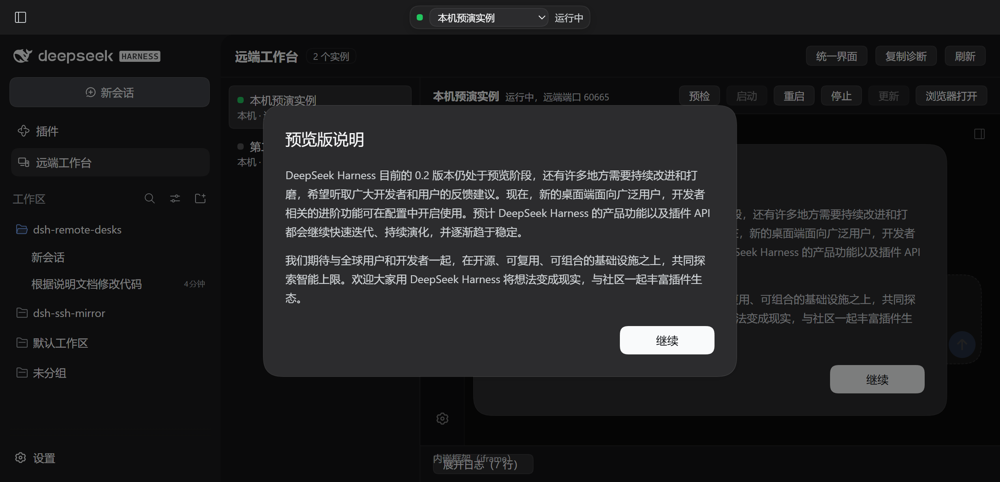
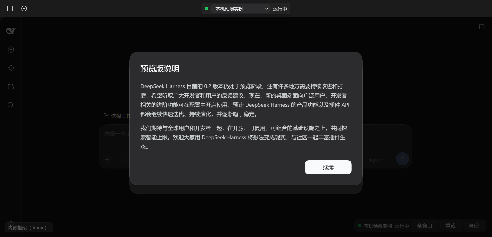
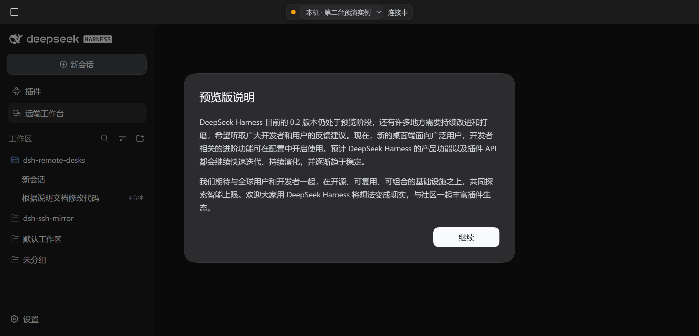

# dsh-remote-desks · 远端工作台

[](LICENSE)
[](https://github.com/TBChaos/dsh-remote-desks/actions/workflows/verify.yml)

把**本机 / WSL / 虚拟机 / SSH 远端**上另一套 DSH 的 WebUI **镜像进桌面版 DSH**，用**同一套界面和体验**
管理它们：点一下窗口上边的下拉框，主区就换成那台机器的那套 DSH；启动、停止、更新也都在这里。

镜像出来的界面就是 DSH 自己的前端（随远端版本走），桌面窗口的外壳、主题、侧栏与快捷键
全部复用当前应用，不另造一套 UI。

> **状态：M0–M8 完成。** 本机、WSL、SSH（含虚拟机 / 远程主机）三种实例都能并发启动、镜像、停止；
> 面板、设置页、日志抽屉、预检、容器降级链都已接好，并且**在真实浏览器里驱动界面验证过**
> （见下方截图与 `pnpm verify:ui`）。M5 起本机那一项**默认吸附桌面应用自己那套 DSH**
> （打开应用就是「运行中」，不另起进程）；M6 起默认是**统一界面**——选中那台机器的 DSH 界面
> 铺满主区，和 WebUI 是同一套 UI 与体验，我们自己的列表 / 工具栏 / 日志收在「管理」里。


左：统一界面（默认）——主区就是那台机器的 DSH，界面和 WebUI 一模一样。
右：管理界面（点浮条上的「管理」）——列表、工具栏、预检、日志都在这里。



「全窗口」把官方侧栏收成窄条，远程那套界面就拿到整扇窗：



切换机器是窗口**上边**那个下拉框的事（桌面版里它钻进标题栏那条带子，谁也不挡）；换过去之后
前一台不卸载，切回来是瞬间的：



## 怎么用（完整流程）

### 一次性准备

```bash
# 1) 装插件（本地目录 / npm 包 / git 地址都行）
dsh plugin --profile desktop add D:\code\dsh-remote-desks
#    或者用桌面版设置里的 Plugins 页安装

# 2) 完整重启桌面应用
```

> **改完必须完整重启，刷新窗口不够。** 这一条是实测出来的（`node scripts/probe-client-reload.mjs`）：
> 宿主在**启动时**就把各插件的客户端 bundle读进内存了（bundle 地址带 `?rev=<内容哈希>`，
> 内容在启动那一刻定死）。所以哪怕只改了客户端那半边，刷新页面也拿不到新代码——
> 这里踩过一次，写下来免得再猜。

重启后侧栏会出现 **「远端工作台」** 入口（在「插件」下面）。此时还没有实例，把下面三段里
你需要的抄进 `C:\Users\<你>\.dsh\profiles\desktop\cordis.patch.yml`：

```yaml
- id: remote-desks
  config:
    instances:
      - id: wsl-ubuntu          # 在 WSL 里跑一个 DSH，用它做 Linux 侧的活
        kind: wsl
        label: WSL · Ubuntu-24.04
        distro: Ubuntu-24.04
        cwd: /home/you/project
      - id: local-dev           # 本机那套 DSH——桌面应用打开时它本来就在跑
        kind: local
        label: 本机
        # profile / cwd 在吸附时用不上（压根没有新进程）；要另起一份独立进程就写 attach: false
      - id: build-server        # 连到服务器上已经在跑的 DSH
        kind: ssh
        label: 构建机
        host: 10.0.0.8
        username: deploy
        cwd: /srv/app
        auth: { method: privateKey, privateKeyPath: C:\Users\you\.ssh\id_ed25519 }
    switcher:                   # 窗口角上的「本机 / WSL」下拉框
      enabled: true
      corner: top-center       # top-center（默认）| top-right | top-left
      offsetX: 56               # 距边缘的像素（默认躲开官方那颗侧栏开关）
      # offsetY 留空 = 跟随官方 --dsh-frame-overlay-top（桌面版 = 标题栏高度 + 20px）
    layout:
      mode: immersive           # immersive 统一界面（默认）｜ manage 管理界面
      collapseSidebar: false    # true = 进统一界面时顺手把官方侧栏收成窄条
```

改完再重启一次（配置在启动时读取）。

### 每天怎么用

1. **打开面板**：侧栏点「远端工作台」。默认就是**统一界面**——选中的那台机器的 DSH 界面铺满主区，
   右下角一条半透明浮条（机器关键字 + 状态 + 全窗口 / 重载 / 管理）。**也可以直接用窗口角上的下拉框**
   换机器（见下文「一键切换」）。要看列表、工具栏、日志就点浮条上的「管理」。
2. **点「预检」**（管理界面，推荐，几秒）：不启动任何东西，逐项告诉你这个实例能不能起来——本机看运行时
   入口与工作目录（吸附的实例只回答吸附本身）；WSL 看发行版能否进入、里面有没有 node 与 dsh；
   SSH 看端口通不通、私钥可读或凭据已配置、跳板逐跳可达。红色项就是缺的东西。
3. **点「启动」**：状态点转黄（启动中）→ 转绿并显示远端端口（运行中），随后主区出现**那台机器上的
   完整 DSH 界面**。首次启动会在目标机自动创建一份隔离 profile（不需要包管理器）。
   **本机实例不用点**：桌面版里它启动时就已经是「运行中」了（吸附，见下文）。
4. **在镜像区里直接干活**：这不是截图也不是只读预览，就是另一台机器上那个 DSH 的真实界面——
   开新会话、发消息、让它读写文件、跑命令，全部发生在**那台机器上**，用那台机器的工具链
   （WSL 实例用发行版里的 Linux 工具，SSH 实例用虚拟机 / 远端主机）。
5. **切实例**：窗口角上的下拉框，或管理界面左侧列表点另一行；各自端口与镜像地址互不影响，多个实例可同时运行。
6. **全窗口**：浮条上的「全窗口」把官方侧栏收成窄条，远程那套界面就拿到整扇窗——这是"和 WebUI 基本一致"
   的最后一块；再点一次展开回来。
7. **看日志**：管理界面底部「展开日志」是该实例进程的 stdout/stderr（增量、自动贴底、可清屏）。
8. **停**：「停止」先收掉镜像端点再终止进程，端口全部释放。吸附的实例没有自己的进程，
   「停止」只收掉镜像——**不会**把桌面应用自己关掉。
9. **偶尔用**：「浏览器打开」把镜像地址交给系统浏览器；「重启」= 停止 + 启动（会换新端口）。

### 两种形态：统一界面（默认）/ 管理界面

| 形态 | 长什么样 | 什么时候用 |
|---|---|---|
| **统一界面**（默认） | 选中那台机器的 DSH 界面**铺满整个主区**，我们自己的列表 / 工具栏 / 日志全部收起，只剩右下角一条半透明浮条（关键字 + 状态 + 全窗口 / 重载 / 管理） | 平时干活：本机 / WSL / 虚拟机 / 远程，点一下就是那台机器的那套界面 |
| **管理界面** | 实例列表 + 工具栏（预检 / 启停 / 更新 / 回滚）+ 镜像 + 日志抽屉 | 配置、排障、更新版本 |

- 切换按钮就在明面上（浮条上的「管理」、表头上的「统一界面」）；**选择记在本地**，下次打开还是你上次那个；
- 默认形态由配置 `layout.mode` 决定，用户点过之后以用户为准；
- 实例没起来时不是把你丢回管理界面，而是一张能直接点「启动」的小卡片；
- 「重载」= 重新挂载镜像载体（卡住、或想重走一遍票据时最省事）。

### 一键切换：窗口上边的机器下拉框

窗口**上边**那个下拉框列出所有启用的实例，**只显示关键字**（`本机` / `WSL · Ubuntu-24.04` /
`SSH · 虚拟机 Ubuntu`），旁边两三个字是状态（`运行中` / `已连接` / `未启动` / `出错`），
完整说明（端口、吸附、错误原因）在悬停提示里。选中一项就做三件事：
**切到「远端工作台」面板 → 需要的话把它跑起来 → 显示它的完整界面**。

摆位是自己算的（`useSwitcherPlacement`），目标是"谁也不挡"：

| 情形 | 位置 | 为什么 |
|---|---|---|
| 桌面版（有窗口标题栏） | **钻进标题栏那一条**，水平居中、垂直居中在带子里 | 那条带子左边是窗口菜单、右边是三个窗口按钮，**中间是空的**；会话表头在它下面一行，所以谁也不挡 |
| 纯 Web 外壳（没有标题栏） | 官方给帧级浮层准备的 `--dsh-frame-overlay-top` | 没有窗口 chrome 可钻，就用官方那条基线 |

- **判断有没有标题栏**用的是官方自己的 token `--dsh-frame-top-clearance`（桌面版 = 标题栏高度，
  Web 外壳没有这个值），不写死平台、也不猜类名；
- 位置**每次现算**：窗口 resize、全屏切换、标题栏标记变化、侧栏收放都会重算
  （`resize` + `ResizeObserver` + 属性 `MutationObserver` + 1 秒兜底轮询）——
  窗口一改，它跟着重新居中，不是"挂上去就不动了"；
- 标题栏那一条是窗口拖动区，所以切换器显式声明 `-webkit-app-region: no-drag`，否则点不动；
- 想自己定就写 `switcher.offsetY`（像素）；`switcher.corner` 另有 `top-right` / `top-left`，
  贴右上角时面板表头会通过 `--drd-switch-reserve` 自动让位。

其他：状态点跟着当前那台走（灰=未启动，绿=运行中）；起不来时**在那里直接写明原因**；
面板里的列表与它共用同一个选中项；不想看到它就 `switcher.enabled: false`。

### 虚拟机怎么接

不用新的 `kind`：虚拟机走的就是 `ssh`（虚拟机里跑 sshd）或 `wsl`（WSL2 里的发行版），
拉起方式、镜像代理、预检、更新全都复用现成的三条腿。给它起个短 `label`，
下拉框里就是那个关键字：

```yaml
- id: vm-ubuntu
  kind: ssh
  label: 虚拟机 Ubuntu        # 下拉框里显示「SSH · 虚拟机 Ubuntu」
  host: 192.168.64.7
  username: dev
  cwd: /srv/app
  auth: { method: privateKey, privateKeyPath: C:\Users\you\.ssh\id_ed25519 }
```

### 本机实例：吸附（打开应用就是「运行中」）

桌面应用打开时，本机那套 DSH（`app.asar` 里的内置运行时）**本来就在跑**——你现在看的这个界面
就是它。所以 `kind: local` 的实例默认**吸附**它，而不是再拉一份同样的运行时：

- 不新起进程，不建 profile：镜像直接指向宿主自己的 `127.0.0.1:19387`；
- 会话 cookie 用宿主自己的进程令牌换（和桌面壳启动时走的是同一条路）；
- **打开应用就已经是「运行中」**，面板里那一项不再是「未启动」；
- 配置文件里的 `profile` / `cwd` / `entry` 在吸附时都不参与（没有进程要启动）；
- 「更新」对它没有意义——它的版本跟着桌面应用自己走，所以会明确拒绝，而不是假装升级成功。

什么时候会吸附，什么时候不会：

| 配置 | 行为 |
|---|---|
| `attach` 留空（默认） | **桌面版内置运行时**才吸附；其它宿主（`dsh web`、验证脚本起的临时宿主）照旧自己拉进程——老配置的语义不会被悄悄改掉 |
| `attach: true` | 无论宿主是什么都吸附（宿主自己的 web 端口 + 进程令牌就够） |
| `attach: false` | 永不吸附，照旧用独立 profile 拉一份自己的 DSH 进程 |

宿主要是拿不到自己的端口或令牌（很老的版本），吸附会**明说做不到**，不会悄悄退回"再拉一份"。

### 界面里各处的含义

| 位置 | 含义 |
|---|---|
| 状态点 | 灰=未启动，黄=启动中/停止中，绿=运行中，红=出错（旁边写明原因） |
| 「运行中，远端端口 N」 | 那个 DSH 在它自己机器上监听的端口（只绑回环，外部访问不到） |
| 「运行中（吸附宿主自身，端口 19387）」 | 这一项没有自己的进程，镜像的就是桌面应用自己那套 |
| 镜像区下方小字 | 当前用的是哪种容器（桌面原生视图 / 内嵌框架 / 系统浏览器）及降级原因 |
| 「预检」结果 | 逐项红绿，缺什么一目了然 |
| 日志抽屉 | 该实例进程的输出；启动失败、更新结果都写在这里 |

### 更新（升级那个实例上的 DSH）

实例**已停止**时，工具栏的「更新」可用：先读出当前版本 → 跑更新命令 → 再读一次版本并记录
结果（面板显示「上次更新：0.2.0-rc.1 → 0.3.0」）。想退回就点「回滚」，它用记下来的旧版本
再跑同一条命令。

默认命令按实例类型给：

| 实例类型 | 默认更新命令 |
|---|---|
| `wsl` / `ssh` | `npm i -g @deepseek-ai/dsh@{version}`（`{version}` 默认 `latest`，回滚时换成旧版本） |
| `local` | **没有默认值**。本机那份 DSH 可能是内置运行时、全局 npm 或自己 clone 的，猜错只会装出一份用不到的副本——请在实例上写 `updateCommand` |

三条硬规矩：

- 运行中的实例拒绝更新（避免半个进程换版本），先「停止」。
- 桌面版**自带运行时**（`app.asar` 里那份）拒绝更新，并告诉你该走桌面应用自己的更新，
  而不是假装成功。
- 命令输出进日志抽屉（只留尾部 40 行，免得 npm 刷屏把环冲掉）；10 分钟不结束会终止。

想用自己的方式更新？在实例配置里写 `updateCommand`，命令里可带 `{version}` 占位符
（带占位符才支持精确回滚）：

```yaml
- id: local-dev
  kind: local
  updateCommand: npm i -g @deepseek-ai/dsh@{version}
```

### 出问题时按这个顺序看

1. 面板点「预检」——多数问题（缺 dsh、私钥读不到、发行版进不去）这一步就写明。
2. 底部「展开日志」——启动失败的具体原因、目标机 stderr 都在这。
3. 设置页「远端工作台」——宿主能力矩阵：运行形态、DSH 发行版入口与来源、10 个宿主服务、
   控制接口的闸门落点。

### 目前不做 / 做不到的

- **不会**在目标机自动安装 DSH：目标机没有 dsh 时只明确告诉你，装什么由你决定。
- 桌面版自带运行时那份 DSH 无法被单独更新（见上）。
- `openMode: rightbar`（把镜像开进官方右栏浏览器标签）是**实验性**的，见下文容器表。

## 它解决什么

同一台机器上经常不止一套 DSH：Windows 本机一套、WSL 里一套、服务器上还有几套。
它们的 WebUI 各自独立，切换要开浏览器、记端口、贴带 token 的地址。

这个插件把那些实例的界面直接搬进桌面应用：左侧列出实例，点一下就在主面板里看到它的
完整界面，并且能在这里启动、停止它们。

## 设计要点（都由发行版源码核实过）

| 约束 | 结论 |
|---|---|
| 桌面窗口允许 `<webview>`，但无 lease 的挂载会被主进程拦掉 | 用官方 `window.dshDesktop.browser.acquire()` 拿 lease，再挂 `<webview>` |
| guest 禁止访问与宿主同端口的回环地址 | **每个实例一个独立端口的镜像端点**，不挂在本地 DSH 的 19387 上 |
| 桌面渲染层 origin 是 `dsh-app://app`，其非静态路径会转发给本地 host | 插件注册的 host 路由在桌面版与纯 Web 版里都能用相对路径 `fetch` 到 |
| 插件路由默认**不鉴权** | 控制接口自带闸门：优先复用官方 `connection.requestRejection`，否则用等价的回环校验 |
| 远端 UI 全部使用文档相对路径（`<base href="./">`、WS 取 `document.baseURI`） | 代理可以原样转发，不需要改写远端 HTML |
| `desktop` profile 由桌面应用独占，且 19387 是硬编码端口 | 自己拉起的实例一律用独立 profile + `--port 0` |

## 安装

```bash
pnpm install
pnpm verify          # tsc + 客户端 bundle + 冒烟测试
dsh plugin --profile desktop add <本目录路径>
```

`cordis.patch.yml` 会被自动并入 profile（`dsh.bundle.patch`）。装好后重启桌面应用，
侧栏会出现「远端工作台」入口；设置页里也有一节同名页面，可以查看宿主能力矩阵。

## 配置

```yaml
- id: remote-desks
  name: dsh-remote-desks
  config:
    instances:
      - id: wsl-ubuntu
        kind: wsl
        distro: Ubuntu-24.04
        user: you
        cwd: /home/you/project
        # 慢速远端可以调大等就绪行的上限（毫秒，默认 90000）
        # readyTimeoutMs: 180000
      - id: local-dev
        kind: local
        label: 本机
        # 吸附（默认，桌面版内置运行时）：不拉进程，打开应用就是运行中。
        # attach: true   # 任何宿主都吸附
        # attach: false  # 永不吸附，用下面这份 profile 自己拉一个独立进程
        profile: mirror-local-dev
        cwd: D:\work\demo
      - id: build-server
        kind: ssh
        host: 10.0.0.8
        username: deploy
        auth:
          method: privateKey
          privateKeyPath: C:\Users\you\.ssh\id_ed25519
    switcher:
      enabled: true
      corner: top-center
      offsetX: 56
    layout:
      mode: immersive          # immersive 统一界面（默认）｜ manage 管理界面
      collapseSidebar: false   # true = 进统一界面时顺手把官方侧栏收成窄条
```

密码与口令**不写进配置**，只写凭据名（`passwordCredential` / `passphraseCredential`），
值放在 DSH 凭据库里。

### 形态与吸附有关的几个字段

| 字段 | 默认 | 说明 |
|---|---|---|
| `layout.mode` | `immersive` | 面板默认形态：统一界面（镜像铺满）/ 管理界面。用户在面板上点过之后以用户为准（记在本地） |
| `layout.collapseSidebar` | `false` | 进统一界面时是否顺手把官方侧栏收成窄条（浮条上的「全窗口」随时可以手动切） |
| `switcher.*` | 见上 | 窗口角上下拉框的开关、贴角与偏移；`offsetY` 留空 = 跟官方 `--dsh-frame-overlay-top` |

### 实例字段里与吸附有关的两个

| 字段 | 默认 | 说明 |
|---|---|---|
| `attach` | 留空 = 自动 | `local` 实例是否吸附宿主自身：留空时**桌面版内置运行时**自动吸附，其它宿主照旧拉进程；`true` 强制吸附；`false` 强制不吸附 |
| `kind` | 必填 | 只有 `local` 参与吸附（`wsl` / `ssh` 上的 DSH 不可能"就是宿主自己"）；虚拟机走 `ssh` / `wsl`，不需要新 kind |
| `label` | 同 id | 下拉框里的**关键字**：括注会被去掉（`本机（内置运行时）` → `本机`），没写类型词就补一个（`虚拟机 Ubuntu` → `SSH · 虚拟机 Ubuntu`） |

## 控制接口

| 方法 | 路径 | 说明 |
|---|---|---|
| `GET` | `/remote-desks/api/state` | 能力矩阵 + 配置摘要 |
| `GET` | `/remote-desks/api/ping` | 存活探测 |
| `GET` | `/remote-desks/api/instances` | 全部实例的运行时快照 |
| `GET` | `/remote-desks/api/instances/:id` | 单个实例快照（含 `phase` / 镜像地址 / 退出码） |
| `GET` | `/remote-desks/api/instances/:id/logs?offset=N` | 增量拉日志（行号偏移，环形缓冲 600 行） |
| `GET` | `/remote-desks/api/instances/:id/check` | **预检**：不启动实例，只列出缺什么（含 DSH 版本） |
| `POST` | `/remote-desks/api/instances/:id/start\|stop\|restart` | 生命周期操作 |
| `GET` | `/remote-desks/api/instances/:id/version` | 探测该实例的 DSH 版本（本机读 package.json，WSL/SSH 跑 `dsh -V`） |
| `POST` | `/remote-desks/api/instances/:id/update` | **更新**：升级该实例上安装的 DSH。可选 JSON 体 `{"target":"0.3.0"}`，省略即 `latest` |
| `POST` | `/remote-desks/api/instances/:id/rollback` | **回滚**到最近一次更新前的版本（要求命令里带 `{version}`） |

更新与回滚的拒绝语义（都是 409 + `message`）：实例未停止、内置运行时（`app.asar`）、
本机实例没配 `updateCommand`、没有可回滚的记录。未知实例一律 404。

**预检**（面板工具栏上的「预检」按钮）回答的是"点了启动会不会失败"：

- 本机：运行时入口是否存在、启动方式（Electron Node 模式 / node）、工作目录、`DSH_HOME`、profile 状态；
  **吸附**的实例不启动任何进程，所以只回答吸附本身（吸附目标端口 + 说明 `profile`/`cwd` 不参与）
- WSL：发行版能否进入、里面有没有 node 与 dsh、启动命令
- SSH：端口是否可达、认证材料是否齐（私钥可读 / 凭据已配置 / agent 存在）、跳板逐跳可达

检查项都是廉价只读探测，不产生副作用；失败项会直接给出"缺什么"而不是一句报错。

**两道闸门叠加**，缺一不可：

1. 官方 `connection.requestRejection`（认识 `trustedHosts` 与 `Sec-Fetch-Site`，并校验会话 cookie）；
2. 本插件自己的回环校验（Host 必须是 `127.0.0.1` / `localhost` / `[::1]`，带 Origin 时其 Host 必须与请求 Host 一致）。

控制接口能启停进程，所以第二层不是多余的。判定的结果会写在 `/api/state` 的 `control.gate` 里。
因此：**裸 curl（没有会话 cookie）拿到 401，伪造非回环 Host 拿到 403**，桌面版与纯 Web 版
（都带 host 自己发的会话 cookie）才拿得到 200。

## 镜像端点

每个**运行中**的实例独占一个只监听回环的 HTTP 端口，把远端实例的 UI 原样搬到
`http://127.0.0.1:<port>/`，HTTP / WebSocket / SSE 都转发。为什么不做成本地 DSH 的一条子路径：

1. 桌面端 Electron guest 明确禁止访问与宿主同端口的回环地址（`isApplicationHost`），挂在 19387 上会被直接拦掉；
2. 同源会让远端实例的脚本能拿着你的 cookie 调本地 `/api`（confused deputy），独立端口天然做掉源隔离。

访问需要票据：首次打开 `?k=<ticket>` 换成 cookie，之后所有子请求与 WS 握手都靠它；
无票据或票据错误一律 403。转发时会把 `host` / `origin` 改写成远端自己的 authority、
注入启动时换好的远端会话 cookie，并剥掉 `content-security-policy` / `x-frame-options`
（否则嵌不进来）与逐跳头，同时把 `set-cookie` 归一成属于镜像 origin 的形态。

### 票据 cookie 会跟着"站"走

桌面版里顶层文档是 `dsh-app://app`（不是 http 源），所以嵌进去的镜像**是第三方 iframe**——
而 `SameSite=Lax` 的 cookie 在第三方 iframe 里不会被带上，症状就是每一个子请求都撞回
403「需要票据」。所以那张票据 cookie 按 `Sec-Fetch-Site` 自适应：

| 这次访问 | 下发的 cookie |
|---|---|
| `cross-site`（或拿不到这个头） | `SameSite=None; Secure`——`Secure` 在 `http://127.0.0.1` 上是允许的（Chromium 把回环当可信来源） |
| `same-origin` / `same-site` | 仍旧 `SameSite=Lax`，少给一点权限 |

`pnpm verify:ui` 里有一条**跨站 iframe 回归**：用另一个窗口把顶层分别换成 `http://localhost:<port>`
（与 127.0.0.1 不同站）与 `file:///…`（更接近桌面版那种非 http 顶层），iframe 直指镜像入口，
再到主进程侧读子帧内容——两种顶层都要渲染出远端 UI、都不能出现「需要票据」。

### 两个镜像相关的配置项

```yaml
mirror:
  host: 127.0.0.1          # 只允许回环
  portRange: [19500, 19510] # 端点在这个范围内找空位；全占满则退回系统分配
  openMode: auto            # 容器偏好，见下表
```

`openMode` 决定镜像用哪种容器承载，四种取值都真的生效（不是解析完就放着）：

| 取值 | 行为 | 真机验证 |
|---|---|---|
| `auto`（默认） | **直接内嵌框架**，不再先试桌面原生视图（那条路要申请租约、等放行，失败还要等看门狗超时——用户实测就是"渲染时间过长"） | ✅ 浏览器里实测走 iframe，且第一屏立刻开始加载 |
| `webview` | 强制桌面原生视图（官方 webview lease，独立分区、不与应用共享 DOM）；挂不上 / 没导航 / 渲染不出来都会自动降级成内嵌框架并写明原因 | ✅ 实测按预期降级并给出说明 |
| `iframe` | 同 `auto` 的内嵌框架（显式写法） | ✅ 实测 iframe + 镜像 UI 渲染 |
| `browser` | 不做内嵌，交给系统浏览器打开 | ✅ 实测面板不再内嵌、给出说明 |
| `rightbar` | **实验性**：先把主区切回对话（右栏是会话作用域的，本面板占着主区时工作面根本没挂载），再尝试把镜像开进官方右栏浏览器标签；失败会退回内嵌框架并说明原因 | ⚠️ 标签能建起来，但**右栏不一定真的打开**；且 `ui-sidebar-browser` 在 Web profile 默认禁用。故不承诺 |

面板上会写明当前用的是哪种容器，方便对着现象排查。

### 为什么"切过去"现在是快的

远端那套前端是**按需组合**的（`plugins/??a,b,c&rev=…` 这种 URL，远端第一次请求时才现读现拼几 MB），
再叠上"下载 → 解析 → 挂载 → 连 WS"，一次冷启动本来就不便宜。四条改动把这份成本挪走或摊掉：

| 改动 | 效果 |
|---|---|
| `auto` 改成内嵌框架优先 | 省掉申请租约 + 等主进程放行 + 看门狗超时（原本最坏要等 6–8 秒才降级） |
| 镜像端口**按实例复用**（记住上次用的那个） | 镜像 origin 就是浏览器缓存与镜像里那套 DSH 的 localStorage 的键；端口稳定 = 第二次打开命中缓存、远端界面的偏好也还在 |
| 镜像端点给**内容寻址**的前端资源做内存缓存（`rev=` / `-<hash>.js`，32 MB 预算，`x-drd-cache: hit` 可查） | 同一份 bundle 不再反复回上游要；`/api/*` 与无哈希路径一律不缓存 |
| 实例一就绪就**预热**：后台把首页引用的 bundle 全抓一遍（并发 3、60 秒预算、纯尽力而为） | 远端的"现拼"成本在用户切过去之前就付掉了；日志里能看到 `预热：N/M 个前端资源已进镜像缓存` |

再加一条交互上的：最近看过的 **3 台镜像保持挂载**（隐藏但不卸载），切回来连 WS 都没断，
是真正的瞬间切换——不是"重新渲染一遍"。

### 镜像区为什么不再"抖"

M4 之前有人看到的现象是：镜像区一直在闪、永远显示不出东西。两个原因，都已修掉，也都进了冒烟断言：

1. **webview 被无限重载**。`<webview>` 的 `dom-ready` 事件对**每一次**导航都触发，而当时的代码是
   "每次 dom-ready 都 `setAttribute('src', entryUrl)`"——于是加载 → dom-ready → 再设一次 src →
   再加载……每几百毫秒一次，界面自然一直在抖，也永远渲染不出东西。现在导航只做一次（`navigated` 闸门），
   并且导航后另有 10 秒的超时兜底。
2. **载体被反复重建**。载体 effect 的依赖里曾经放着宿主服务对象，而那个对象**每次渲染都是新的**
   （slot 的 `inject` 回调每次调用都返回新对象）。外壳一重渲染，effect 就"拆掉视图 → 重新挂一个"，
   表现同样是闪。现在服务走 ref，依赖只剩「镜像地址」和「容器偏好」——只在这两件事变了才重建。

另外，桌面原生视图"挂上了却是空的"现在会**自动降级**成内嵌框架（不是只给一个按钮）：加载完成后
等 2.5 秒探一眼 guest 里到底有没有内容，确实是空的就换载体并在下方写明原因。

### 降级判定的三个看门狗（以及一个踩过的坑）

试桌面原生视图时，三步各自有上限，超了就换内嵌框架并把原因写在镜像区下方：

| 看门狗 | 上限 | 说明 |
|---|---|---|
| 挂载 | 6 秒 | 挂上去连 `dom-ready` 都没来：多半是主进程没放行（租约 / partition 不匹配） |
| 导航 | 8 秒 | 已经发出导航但没加载完：被拦、或上游挂着 |
| 内容 | 加载完 + 2.5 秒 | 加载"完成"了里面却是空的（远端 UI 没渲染出来） |

> **踩过的坑**：`did-finish-load` 对最初那一跳 `about:blank#<lease>` 也会触发。曾经把
> "还是 about:blank 就算没导航"直接写在这个回调里——于是在导航还没开始时就误判成
> "主进程拒绝了挂载"，并立刻降级。现在降级判定只在真的发出过导航之后才生效，并且导航后
> 1 秒内到达的那次"加载结束"直接忽略；"没导航"那条提示还会把当时的地址一起打出来。

## WSL 的三条硬约束（都实测过）

写 WSL 启动命令时踩到的坑，已固化在默认命令里：

1. **必须单行**：多行命令在 Windows → WSL 这一跳会丢换行；
2. **不能有变量赋值**：`P=...`、`export P=...`、`declare P=...` 都会被 wsl.exe 当环境变量赋值吃掉
   （所以路径一律内联 `$HOME`）；
3. **不含双引号**：JSON 用 base64 传进去，把引号一起消掉。

另外两个环境事实：发行版里的 node 常常只配在 `~/.bashrc`（nvm），登录 shell 不加载，所以默认命令
会显式 source `~/.nvm/nvm.sh`；WSL 里绑 `127.0.0.1` 的端口能否被 Windows 直连取决于网络模式
（镜像网络可以，默认 NAT 不行），监管器会**先探测再决定**，不通就给出明确诊断而不是留一个连不上的镜像。

> 想用自己的启动方式？把 `launchCommand` 写进实例配置即可，但上面三条约束同样适用。

## SSH 实例

```yaml
- id: build-server
  kind: ssh
  host: 10.0.0.8
  port: 22
  username: deploy
  cwd: /srv/app
  auth:
    method: password                 # privateKey | password | agent
    passwordCredential: BUILD_SERVER_PASSWORD
  # 可选：固定主机密钥指纹（SHA256 base64）
  # hostKeyFingerprint: SHA256:xxxx
  # 可选：跳板链
  # jumpHosts:
  #   - { host: jump.example, port: 22, username: ops }
```

- **认证**：`privateKey` 读 `privateKeyPath`（口令走 `passphraseCredential`）、`password` 走
  `passwordCredential`、`agent` 用 `SSH_AUTH_SOCK`（Windows 退到 `\\.\pipe\openssh-ssh-agent`）。
- **凭据**：`*Credential` 字段是 DSH 凭据库里的**名字**。名字也可以直接是环境变量名——
  凭据服务本身就把进程环境当作一层来源，所以 CI/验证场景不必往凭据库里写东西。
- **主机密钥**：默认 TOFU——接受并在实例日志里打印 `SHA256:…` 指纹；把指纹写进
  `hostKeyFingerprint` 即变成硬校验，不匹配直接拒连。
- **数据面**：控制面与数据面**共用一条 SSH 连接**，每条上游请求就是一条 `direct-tcpip` 通道
  （`forwardOut`）。远端不需要暴露端口，也不用建本地端口转发；换 cookie 的那次请求同样走隧道。

### 本机怎么验证 SSH 腿

这台机器上既没有 Windows sshd、WSL 也没装 openssh-server，所以仓库自带一个**测试对端**
（`scripts/ssh-test-server.mjs`，用 ssh2 的 Server 实现，把 exec 与 direct-tcpip 都转给 WSL）：

```bash
node scripts/ssh-test-server.mjs --port 12222 --password dsh-test      # 手动起
node scripts/verify-live.mjs --ssh --pnpm <pnpm.mjs> --node <node.exe> # 验证脚本自己起
```

它只用于验证**我们这一侧**的连接、认证、通道与隧道代码，**不要当生产服务用**。

## 开发

```bash
pnpm install
pnpm build        # tsc -> lib/，再把客户端打成一枚 __ModuleLoader__ bundle
pnpm typecheck    # host 与 client 两套 tsconfig
pnpm smoke        # 载入真实产物跑行为断言（288 项）
pnpm verify       # build + smoke
pnpm verify:live  # 起一个真实 DSH 实例做端到端验证（见下）
```

另外一个专门的预演脚本——**用桌面版自带运行时把"点启动"整条路径走一遍**：

```bash
node scripts/verify-electron-local.mjs [--app "<DeepSeek Harness.exe>"]
```

它不宿主、不起 profile 树，而是直接调本插件的 `planFor` / `exchangeSession` / `MirrorEndpoint`：
用 `app.asar` 里的 DSH 入口 + Electron Node 模式构造启动计划（校验 argv 与 env），真的把进程
起起来，等就绪行、换会话 cookie、起镜像端点、经代理取回远端 UI。这条路径与你第一次点「启动」
时执行的完全一致。

**第三道 · `pnpm verify:ui`（真实浏览器驱动界面）** 起宿主后，用 Electron（与桌面应用同一套
Chromium）打开真实界面，走正常入口（token → cookie），然后**真的去点**：

```
ok  界面已加载 — /
ok  窗口角上出现切换下拉框 — {"corner":"top-right","gapRight":56,"pointerEvents":"auto","options":["本机预演实例"],"value":"ui-local"}
ok  切换器在视口内、贴右上角 / 自己接回指针事件（浮层是点击穿透的）/ 列出了实例
ok  侧栏里找到本插件入口 {"label":"远端工作台", …}
ok  默认形态是统一界面 — {"immersive":true,"hasList":false,"hasToolbar":false,"buttons":["启动","管理界面"]}
ok  未运行时给的是启动卡片（不是把人丢进管理界面） — 启动 / 管理界面
ok  卡片上的「管理界面」能切过去 / 切换后管理界面出来了
ok  面板渲染出内容 / 面板里看得到实例 / 切换器的选中项与面板一致
ok  点到了「启动」 → 面板显示运行中 → 镜像容器类型符合预期（iframe）
ok  管理界面上的「统一界面」能切回去
ok  统一界面下镜像铺满主区 — 容器 {"w":987,"h":611}｜镜像 {"w":987,"h":611}
ok  统一界面下浮条还在
ok  「全窗口」把官方侧栏收成了窄条 / 再点一次能展开回来
ok  localhost：镜像帧存在 / 不再显示「需要票据」/ 渲染出远端 UI
ok  跨站 iframe 下发的票据 cookie 是 SameSite=None; Secure — dsh_mirror=…; SameSite=None; Secure
ok  file：镜像帧存在 / 不再显示「需要票据」/ 渲染出远端 UI
ok  控制台无报错
```

跑完把截图写到 `.recon/ui/`（`panel-stopped.png` / `panel-running.png` / `panel-immersive.png` /
`panel-immersive-fullwindow.png` / `cross-site-*.png`），可以直接看。

`--open-mode all` 会把五种容器各跑一遍（`rightbar` 是实验性，只验"不崩、有说明"）：

```
openMode=auto    通过（11 项）    openMode=iframe  通过（9 项）
openMode=webview 通过（9 项）     openMode=browser 通过（9 项）
openMode=rightbar 通过（3 项，实验性，不做严格断言）
```

> 这个脚本当初一跑就抓到一个会让面板**完全不出现**的 bug：slot 的 `inject` 回调里读了
> `ctx.layout` 却没在插件 `inject` 列表里声明，Cordis 抛 "cannot get property ... without
> inject"，注册整体失败。冒烟、SSR、活体 HTTP 全都测不出来——只有真壳子会暴露。

### 三道验证

**第一道 · `pnpm smoke`（285 项）** 跑真实产物，不复述实现：

1. 导入 `lib/index.js`，检查插件契约（`name` / `inject` / `Config` / `apply`），
   用真实 `Config` 校验空配置补全、默认值、非法 `kind` / `corner` 与缺 `id` 的拒绝；
2. 用伪造 `ctx` 调 `apply()`，再拿**真实 handler** 发请求：回环 200、IPv6 回环 200、
   局域网 Host 403、跨站 Origin 403、未知路径 404、非 GET 404、缺 Host 403；
   再用带 `connection.requestRejection` 的 ctx 验证**两道闸门叠加**（官方拒绝 401、
   官方放行但非回环仍 403）；
3. 在 `node:vm` 里加载 `lib/client.js`，喂假的 `window.__ModuleLoader__` 与 `require`
   （非基线模块直接报错），取出工厂并调 `apply()`，断言它挂上了
   `sidebar.panellist` / `main` / `settings.section` / `shell.overlay` 四处注册，且面板 id 与入口 id 一致；
4. 用 `react-dom/server` 把面板（统一界面 / 管理界面 / 空配置 / 带数据 / 吸附中 / 未运行的启动卡片）、
   实例列表、工具栏、切换器（正常 / 关掉 / 无实例）真的渲染一遍，并单测短标签与状态词
   （去括注、补类型词、退回 id、吸附时叫「已连接」）；
5. **票据 cookie 的跨站形态**：跨站访客拿到 `SameSite=None; Secure`、同站拿到 `Lax`、
   带上跨站 cookie 能取回上游内容、不带仍旧 403；缓存判据（只认内容寻址、未压缩的静态资源）；
6. **吸附的端到端**：拿一个真的会 `303 + set-cookie` 的假宿主，走一遍
   「等令牌 → 换 cookie（含启动早期的 404 退避）→ 起镜像端点 → **预热** → 票据换 cookie →
   取回宿主 UI → 同一份 bundle 第二次命中缓存」，并断言全程**没有**调用 subprocess、
   停止不动宿主、再吸附复用同一个镜像端口、`autoAttach` 只接该接的那条。

**第二道 · `pnpm verify:live`（三条腿：本机 / WSL / SSH）** 起一个真实 DSH web 宿主（临时 profile，
`dsh-base` + `dsh-web-app` + 本插件），在里面驱动插件真的拉起实例，并逐条验证：

```bash
node scripts/verify-live.mjs \
  --pnpm "C:\Users\you\.dsh\dsh-runtimes\dsh-primary-runtime\dependencies\pnpm\bin\pnpm.mjs" \
  --node "C:\Users\you\.dsh\dsh-runtimes\dsh-primary-runtime\dependencies\node\bin\node.exe" \
  --wsl Ubuntu-24.04 --ssh
```

它会：等 `dsh web:` 就绪行 → 裸请求被拒（401）→ token 换 cookie → 能力矩阵 200
（`gate = connection.requestRejection + loopback-guard`）→ 伪造非回环 Host 得 403 →
index 的 `window.__DSH_BOOT__` 里出现本插件的行 → 取到 `__ModuleLoader__` 形态的客户端 bundle；
然后对**每一个**实例：启动 → 就绪 → 无票据 403 → 票据换 cookie 302 → **镜像 UI 200** →
镜像里的子资源 200 → 停止 → 端点收摊。跑完自动清理 profile（`--keep-profile` 可保留）。

它还带两个**故意坏掉**的实例，专门盯失败路径：入口文件不存在的本机实例（进程退出 → `error`
→ 有可读原因 → 不暴露端点 → **仍可重试**），以及永不打印就绪行的 WSL 实例（按
`readyTimeoutMs` 超时 → `error` → "等待就绪行超时"）。

**吸附宿主自身**也在里面走了一遍（临时 profile 里那条 `attach: true` 的实例）：

```
ok  吸附实例启动时自动进入 running — running：运行中（吸附宿主自身，端口 19413）
ok  吸附的"远端端口"就是宿主端口 — 19413 vs 19413
ok  吸附时没有起第二个进程（日志里没有启动命令）
ok  吸附镜像取回宿主 UI → 200 — 200
ok  吸附镜像就是宿主自己那套（含本插件行）
ok  停止吸附后宿主自己照旧在跑 — 200
ok  再吸附后回到 running / 换了新票据 / 镜像照旧可取
```

这一节压的是两条**启动时序**：进程令牌要等 `connection` 挂上，`/` 要等前端静态兜底认领——
两处都不是"失败就该放弃"，而是"等一等/重试几轮"。

**更新与回滚则在三条通道上各走一遍**（本机 / WSL / SSH），命令统一用无害的
`echo update-probe {version}`——验证脚本不该动你机器上的真实安装：

```
ok  WSL 通道探测到版本 — 0.1.5-rc.3（来源 dsh -V）
ok  SSH 通道探测到版本 — 0.1.5-rc.3（来源 dsh -V）
ok  WSL 通道更新成功 — 更新命令以 0 退出（版本 0.1.5-rc.3 → 0.1.5-rc.3）
ok  SSH 通道回滚成功 — echo update-probe 0.1.5-rc.3
```

这三条各自压着不同的代码路径：本机读 `package.json`；WSL 走 `wsl.exe` + bash（要带 nvm 前置，
否则非交互 shell 里找不到 node）；SSH 临时开一条连接、用完即收（日志里能看到"目标 SSH 连接已关闭"）。

**第三道 · 装进桌面版**：`dsh-remote-desks` 已装入 desktop profile，`dsh.bundle.patch` 会把
`remote-desks` 行插进 Loader 树。桌面版是**启动型 profile**，加载新 bundle 行需要**重启一次
桌面应用**；重启后侧栏出现「远端工作台」入口，窗口右上角出现「本机 / WSL」下拉框，
`kind: local` 那一项应当已经是「运行中（吸附宿主自身）」。

> 客户端那一半是**应用启动时读进内存**的（bundle 地址带内容哈希），所以改了客户端必须完整重启，
> 刷新窗口不够——这条是实测出来的（`node scripts/probe-client-reload.mjs`），M5 也一样适用。

## 布局

```
src/
  index.ts              host 入口：装配、控制路由、自机端点探测、就绪日志
  config.ts             配置 schema 与类型（含 attach / switcher / layout）
  capabilities.ts       宿主能力探测（服务、运行形态、DSH 发行版入口、自机端口）
  control/routes.ts     控制接口 + 回环闸门
  instances/attach.ts   吸附判定：这条本机实例该不该接上宿主自己
  client/index.tsx      客户端半边：统一/管理两种形态、侧栏入口、设置页、窗口角切换器
  client/workbench.ts   客户端共享状态：实例列表 + 宿主能力 + 选中项 + 形态（单一轮询、短标签）
scripts/
  build-client.mjs      客户端 bundle 打包（__ModuleLoader__ 外壳）
  smoke.mjs             载入期冒烟测试（含吸附的镜像往返）
  verify-live.mjs       活体验证：起真实实例跑端到端（含吸附宿主自身）
  verify-ui.mjs         真实浏览器驱动界面（六种容器档）
  verify-electron-local.mjs  用桌面自带运行时预演"点启动"
  probe-client-reload.mjs    实测"改客户端要不要重启"（结论：要）
  ssh-test-server.mjs   测试用 SSH 对端（exec 与 direct-tcpip 转给 WSL）
cordis.patch.yml        bundle patch（安装时并入 profile）
.recon/                 侦察产物（解包的 DSH 发行版源码 + 笔记），已 gitignore
```

## 里程碑与范围

| 阶段 | 内容 | 状态 |
|---|---|---|
| M0 | 骨架、能力探测、控制接口、面板占位 | **完成并验证** |
| M1 | 多实例并发：实例监管器、本机与 WSL 启动器、镜像代理、面板标签切换 | **完成并验证**（本机 + WSL 两条腿） |
| M2 | SSH 实例（含跳板机，数据面走 `forwardOut`，不开远端端口） | **完成并验证**（测试对端，真实 SSH 协议） |
| M3 | 打磨：多实例并发验证、日志抽屉、纯 Web 版适配、文档 | **完成**（界面渲染待你验收） |
| M4 | 更新：版本探测、按类型选择更新命令、回滚、结果入日志与面板 | **完成并验证**（机制用无害命令验证；内置运行时明确拒绝） |
| M5 | 本机吸附（打开应用即运行中）、窗口角「本机 / WSL」切换、镜像容器抖动修复 | **完成并验证**（吸附在真实宿主上跑通镜像往返；抖动两处根因都进了回归断言） |
| M6 | 统一界面（远程 UI 铺满主区，同 WebUI 的界面与体验）、短标签下拉框、全窗口、形态记忆 | **完成并验证**（浏览器里量到镜像与容器等大 987×611；「全窗口」收侧栏有断言） |
| M7 | 桌面版可用性：票据 cookie 按站自适应（第三方 iframe 也能用）、降级判定不再误报 | **完成并验证**（跨站 iframe 在 localhost / file:// 两种顶层下都渲染出远端 UI；误报的回调时序进了回归断言） |
| M8 | 速度与摆位：内嵌框架优先、镜像端口复用、内容寻址资源的镜像缓存 + 就绪预热、最近 3 台保活、切换器摆位自己算（钻进标题栏带子、跟随窗口重算） | **完成并验证**（活体里子资源首次即命中缓存；浏览器里量到切换器在 44px 标题栏带子内、且不压主区内容，窗口变窄仍居中） |

## 已知边界（未自动验证的部分）

自动化能证明的都证明了；剩下这几条要么需要人眼，要么需要真实环境，写在这里免得误以为都覆盖了：

1. **面板与镜像容器的交互渲染**：`pnpm smoke` 用 `react-dom/server` 把面板、实例列表、工具栏、
   侧栏图标、设置页、窗口角切换器都真的渲染了一遍——包括**带数据**的列表（运行中/已停止、状态点、
   端口、吸附实例、按钮禁用态）、空列表指引、切换器的三种状态（正常 / 关掉 / 无实例）、
   统一界面的启动卡片与浮条。`pnpm verify:ui` 则在真实 Chromium 里把两种形态都点了一遍
   （默认统一界面 → 启动卡片 → 管理界面 → 启动 → 回统一界面 → 量矩形 → 全窗口）。
   仍然没覆盖的是"桌面 Electron 外壳里 `<webview>` 真实渲染"那半边。
2. **真实 sshd 的互操作**：SSH 腿用仓库自带的测试对端（ssh2 Server，真实 SSH 协议）验证，
   覆盖了连接、密码认证、exec、`direct-tcpip`、隧道换 cookie、镜像往返。**没覆盖**的是各家
   sshd 的特有行为：`keyboard-interactive`、`ProxyJump` 在服务端的配置差异、以及主机密钥
   指纹固定的实际拒连（代码里有，但没拿真实指纹试过）。
3. **纯 Web 版**：控制接口、鉴权闸门、客户端 bundle 都是在纯 web 宿主（`dsh-base` + `dsh-web-app`，
   无 Electron）里验证的，所以宿主侧等价；只有"iframe 容器长什么样"没看。
4. **长稳**：验证是秒级到分钟级的往返，没有做小时级稳定性与内存观测（日志环已有上限，600 行）。
5. **桌面版 `<webview>` 载体的主进程那一半**。放行权在桌面主进程手里：`will-attach-webview`
   只认通过 `window.dshDesktop.browser.acquire()` 拿到的租约。我试过两种模拟：

   - 用 preload 注入桥：壳子一启动就看见 `dshDesktop`，直接走进 desktop 分支的引导页
     （"欢迎使用 / 开始设置"），根本到不了面板；
   - **页面就绪后注入桥**（`pnpm verify:ui --open-mode webview-client`）：这条路走通了，
     于是**客户端那一半现在是验证过的**——`partition` 先于 `src`、先挂 `about:blank#<lease>`、
     `dom-ready` 后导航，实测 webview 挂上、宿主侧看到 guest、guest 的 URL 变成镜像端点。

   仍然没验的是**主进程那半边**（那段 guard 的放行规则本身），以及 guest 在这个模拟壳子里
   能否渲染出远端 UI（观察结果是没渲染：这个壳子没有真桌面应用那套会话与分区准备）。
   所以请你在桌面应用里点一次确认；失败时面板会写明降级原因（超时/加载失败/租约不完整都会说），
   而且"挂上了却是空的"现在会自动换成内嵌框架。
6. **桌面版里"本机吸附"的最终外观**：吸附的宿主侧行为在真实 DSH 宿主上验过（自动运行中、
   镜像往返、停止不动宿主、可再吸附），但**桌面版 Electron 里那个 19387 端口**、以及镜像出来的
   本机界面在 guest 里长什么样，仍然只有在真桌面应用里看才算数。

## 许可

[MIT](LICENSE) © 2026 TBChaos

欢迎提 issue / PR。改动前建议跑一遍 `pnpm verify`（类型检查 + 构建 + 288 项冒烟）；
碰了实例生命周期或镜像代理就再跑 `pnpm verify:live`，碰了界面就再跑 `pnpm verify:ui`。
