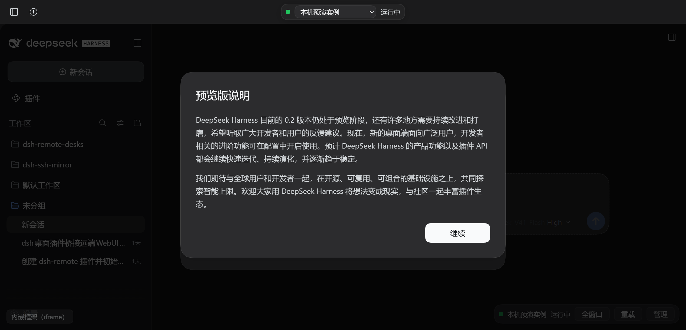

# dsh-remote-desks · 远端工作台

把**本机 / WSL / SSH 远端**上另一套 DSH 的 WebUI **镜像进桌面版 DSH**，并在同一套界面里
启动、停止这些实例。

镜像出来的界面就是 DSH 自己的前端（随远端版本走），桌面窗口的外壳、主题、侧栏与快捷键
全部复用当前应用，不另造一套 UI。

> **状态：M0 / M1 / M2 / M3 完成。** 本机、WSL、SSH 三种实例都能并发启动、镜像、停止；
> 面板、设置页、日志抽屉、预检、容器降级链都已接好，并且**在真实浏览器里驱动界面验证过**
> （见下方截图与 `pnpm verify:ui`）。剩下真正需要人眼的只有桌面版 Electron `<webview>` 那条路。



## 怎么用（完整流程）

### 一次性准备

```bash
# 1) 装插件（本地目录 / npm 包 / git 地址都行）
dsh plugin --profile desktop add D:\code\dsh-remote-desks
#    或者用桌面版设置里的 Plugins 页安装

# 2) 重启桌面应用（启动型 profile，新 bundle 行必须重启才加载）
```

重启后侧栏会出现 **「远端工作台」** 入口（在「插件」下面）。此时还没有实例，把下面三段里
你需要的抄进 `C:\Users\<你>\.dsh\profiles\desktop\cordis.patch.yml`：

```yaml
- id: remote-desks
  config:
    instances:
      - id: wsl-ubuntu          # 在 WSL 里跑一个 DSH，用它做 Linux 侧的活
        kind: wsl
        label: WSL · Ubuntu-24.04
        distro: Ubuntu-24.04
        cwd: /home/you/project
      - id: local-dev           # 在本机再跑一个 DSH（用桌面版自带运行时）
        kind: local
        label: 本机
        profile: mirror-local-dev
        cwd: D:\work\demo
      - id: build-server        # 连到服务器上已经在跑的 DSH
        kind: ssh
        label: 构建机
        host: 10.0.0.8
        username: deploy
        cwd: /srv/app
        auth: { method: privateKey, privateKeyPath: C:\Users\you\.ssh\id_ed25519 }
```

改完再重启一次（配置在启动时读取）。

### 每天怎么用

1. **打开面板**：侧栏点「远端工作台」。左侧是实例列表（状态点 + 本机/WSL/SSH 标记），
   右侧是选中实例的详情与镜像区，底部是日志抽屉。
2. **点「预检」**（推荐，几秒）：不启动任何东西，逐项告诉你这个实例能不能起来——本机看运行时
   入口与工作目录；WSL 看发行版能否进入、里面有没有 node 与 dsh；SSH 看端口通不通、私钥可读
   或凭据已配置、跳板逐跳可达。红色项就是缺的东西。
3. **点「启动」**：状态点转黄（启动中）→ 转绿并显示远端端口（运行中）。首次启动会在目标机自动
   创建一份隔离 profile（不需要包管理器）。随后镜像区出现**那台机器上的完整 DSH 界面**。
4. **在镜像区里直接干活**：这不是截图也不是只读预览，就是另一台机器上那个 DSH 的真实界面——
   开新会话、发消息、让它读写文件、跑命令，全部发生在**那台机器上**，用那台机器的工具链
   （WSL 实例用发行版里的 Linux 工具，SSH 实例用远端主机）。
5. **切实例**：列表里点另一行即可；各自端口与镜像地址互不影响，多个实例可同时运行。
6. **看日志**：底部「展开日志」是该实例进程的 stdout/stderr（增量、自动贴底、可清屏）。
7. **停**：「停止」先收掉镜像端点再终止进程，端口全部释放。
8. **偶尔用**：「浏览器打开」把镜像地址交给系统浏览器；「重启」= 停止 + 启动（会换新端口）。

### 界面里各处的含义

| 位置 | 含义 |
|---|---|
| 状态点 | 灰=未启动，黄=启动中/停止中，绿=运行中，红=出错（旁边写明原因） |
| 「运行中，远端端口 N」 | 那个 DSH 在它自己机器上监听的端口（只绑回环，外部访问不到） |
| 镜像区下方小字 | 当前用的是哪种容器（桌面原生视图 / 内嵌框架 / 系统浏览器）及降级原因 |
| 「预检」结果 | 逐项红绿，缺什么一目了然 |
| 日志抽屉 | 该实例进程的输出；启动失败、更新结果都写在这里 |

### 更新（升级那个实例上的 DSH）

实例**已停止**时，工具栏的「更新」可用：先读出当前版本 → 跑更新命令 → 再读一次版本并记录
结果（面板显示「上次更新：0.2.0-rc.1 → 0.3.0」）。想退回就点「回滚」，它用记下来的旧版本
再跑同一条命令。

默认命令按实例类型给：

| 实例类型 | 默认更新命令 |
|---|---|
| `wsl` / `ssh` | `npm i -g @deepseek-ai/dsh@{version}`（`{version}` 默认 `latest`，回滚时换成旧版本） |
| `local` | **没有默认值**。本机那份 DSH 可能是内置运行时、全局 npm 或自己 clone 的，猜错只会装出一份用不到的副本——请在实例上写 `updateCommand` |

三条硬规矩：

- 运行中的实例拒绝更新（避免半个进程换版本），先「停止」。
- 桌面版**自带运行时**（`app.asar` 里那份）拒绝更新，并告诉你该走桌面应用自己的更新，
  而不是假装成功。
- 命令输出进日志抽屉（只留尾部 40 行，免得 npm 刷屏把环冲掉）；10 分钟不结束会终止。

想用自己的方式更新？在实例配置里写 `updateCommand`，命令里可带 `{version}` 占位符
（带占位符才支持精确回滚）：

```yaml
- id: local-dev
  kind: local
  updateCommand: npm i -g @deepseek-ai/dsh@{version}
```

### 出问题时按这个顺序看

1. 面板点「预检」——多数问题（缺 dsh、私钥读不到、发行版进不去）这一步就写明。
2. 底部「展开日志」——启动失败的具体原因、目标机 stderr 都在这。
3. 设置页「远端工作台」——宿主能力矩阵：运行形态、DSH 发行版入口与来源、10 个宿主服务、
   控制接口的闸门落点。

### 目前不做 / 做不到的

- **不会**在目标机自动安装 DSH：目标机没有 dsh 时只明确告诉你，装什么由你决定。
- 桌面版自带运行时那份 DSH 无法被单独更新（见上）。
- `openMode: rightbar`（把镜像开进官方右栏浏览器标签）是**实验性**的，见下文容器表。

## 它解决什么

同一台机器上经常不止一套 DSH：Windows 本机一套、WSL 里一套、服务器上还有几套。
它们的 WebUI 各自独立，切换要开浏览器、记端口、贴带 token 的地址。

这个插件把那些实例的界面直接搬进桌面应用：左侧列出实例，点一下就在主面板里看到它的
完整界面，并且能在这里启动、停止它们。

## 设计要点（都由发行版源码核实过）

| 约束 | 结论 |
|---|---|
| 桌面窗口允许 `<webview>`，但无 lease 的挂载会被主进程拦掉 | 用官方 `window.dshDesktop.browser.acquire()` 拿 lease，再挂 `<webview>` |
| guest 禁止访问与宿主同端口的回环地址 | **每个实例一个独立端口的镜像端点**，不挂在本地 DSH 的 19387 上 |
| 桌面渲染层 origin 是 `dsh-app://app`，其非静态路径会转发给本地 host | 插件注册的 host 路由在桌面版与纯 Web 版里都能用相对路径 `fetch` 到 |
| 插件路由默认**不鉴权** | 控制接口自带闸门：优先复用官方 `connection.requestRejection`，否则用等价的回环校验 |
| 远端 UI 全部使用文档相对路径（`<base href="./">`、WS 取 `document.baseURI`） | 代理可以原样转发，不需要改写远端 HTML |
| `desktop` profile 由桌面应用独占，且 19387 是硬编码端口 | 自己拉起的实例一律用独立 profile + `--port 0` |

## 安装

```bash
pnpm install
pnpm verify          # tsc + 客户端 bundle + 冒烟测试
dsh plugin --profile desktop add <本目录路径>
```

`cordis.patch.yml` 会被自动并入 profile（`dsh.bundle.patch`）。装好后重启桌面应用，
侧栏会出现「远端工作台」入口；设置页里也有一节同名页面，可以查看宿主能力矩阵。

## 配置

```yaml
- id: remote-desks
  name: dsh-remote-desks
  config:
    instances:
      - id: wsl-ubuntu
        kind: wsl
        distro: Ubuntu-24.04
        user: you
        cwd: /home/you/project
        # 慢速远端可以调大等就绪行的上限（毫秒，默认 90000）
        # readyTimeoutMs: 180000
      - id: local-dev
        kind: local
        profile: mirror-local-dev
        cwd: D:\work\demo
      - id: build-server
        kind: ssh
        host: 10.0.0.8
        username: deploy
        auth:
          method: privateKey
          privateKeyPath: C:\Users\you\.ssh\id_ed25519
```

密码与口令**不写进配置**，只写凭据名（`passwordCredential` / `passphraseCredential`），
值放在 DSH 凭据库里。

## 控制接口

| 方法 | 路径 | 说明 |
|---|---|---|
| `GET` | `/remote-desks/api/state` | 能力矩阵 + 配置摘要 |
| `GET` | `/remote-desks/api/ping` | 存活探测 |
| `GET` | `/remote-desks/api/instances` | 全部实例的运行时快照 |
| `GET` | `/remote-desks/api/instances/:id` | 单个实例快照（含 `phase` / 镜像地址 / 退出码） |
| `GET` | `/remote-desks/api/instances/:id/logs?offset=N` | 增量拉日志（行号偏移，环形缓冲 600 行） |
| `GET` | `/remote-desks/api/instances/:id/check` | **预检**：不启动实例，只列出缺什么（含 DSH 版本） |
| `POST` | `/remote-desks/api/instances/:id/start\|stop\|restart` | 生命周期操作 |
| `GET` | `/remote-desks/api/instances/:id/version` | 探测该实例的 DSH 版本（本机读 package.json，WSL/SSH 跑 `dsh -V`） |
| `POST` | `/remote-desks/api/instances/:id/update` | **更新**：升级该实例上安装的 DSH。可选 JSON 体 `{"target":"0.3.0"}`，省略即 `latest` |
| `POST` | `/remote-desks/api/instances/:id/rollback` | **回滚**到最近一次更新前的版本（要求命令里带 `{version}`） |

更新与回滚的拒绝语义（都是 409 + `message`）：实例未停止、内置运行时（`app.asar`）、
本机实例没配 `updateCommand`、没有可回滚的记录。未知实例一律 404。

**预检**（面板工具栏上的「预检」按钮）回答的是"点了启动会不会失败"：

- 本机：运行时入口是否存在、启动方式（Electron Node 模式 / node）、工作目录、`DSH_HOME`、profile 状态
- WSL：发行版能否进入、里面有没有 node 与 dsh、启动命令
- SSH：端口是否可达、认证材料是否齐（私钥可读 / 凭据已配置 / agent 存在）、跳板逐跳可达

检查项都是廉价只读探测，不产生副作用；失败项会直接给出"缺什么"而不是一句报错。

**两道闸门叠加**，缺一不可：

1. 官方 `connection.requestRejection`（认识 `trustedHosts` 与 `Sec-Fetch-Site`，并校验会话 cookie）；
2. 本插件自己的回环校验（Host 必须是 `127.0.0.1` / `localhost` / `[::1]`，带 Origin 时其 Host 必须与请求 Host 一致）。

控制接口能启停进程，所以第二层不是多余的。判定的结果会写在 `/api/state` 的 `control.gate` 里。
因此：**裸 curl（没有会话 cookie）拿到 401，伪造非回环 Host 拿到 403**，桌面版与纯 Web 版
（都带 host 自己发的会话 cookie）才拿得到 200。

## 镜像端点

每个**运行中**的实例独占一个只监听回环的 HTTP 端口，把远端实例的 UI 原样搬到
`http://127.0.0.1:<port>/`，HTTP / WebSocket / SSE 都转发。为什么不做成本地 DSH 的一条子路径：

1. 桌面端 Electron guest 明确禁止访问与宿主同端口的回环地址（`isApplicationHost`），挂在 19387 上会被直接拦掉；
2. 同源会让远端实例的脚本能拿着你的 cookie 调本地 `/api`（confused deputy），独立端口天然做掉源隔离。

访问需要票据：首次打开 `?k=<ticket>` 换成 cookie，之后所有子请求与 WS 握手都靠它；
无票据或票据错误一律 403。转发时会把 `host` / `origin` 改写成远端自己的 authority、
注入启动时换好的远端会话 cookie，并剥掉 `content-security-policy` / `x-frame-options`
（否则嵌不进来）与逐跳头，同时把 `set-cookie` 归一成属于镜像 origin 的形态。

### 两个镜像相关的配置项

```yaml
mirror:
  host: 127.0.0.1          # 只允许回环
  portRange: [19500, 19510] # 端点在这个范围内找空位；全占满则退回系统分配
  openMode: auto            # 容器偏好，见下表
```

`openMode` 决定镜像用哪种容器承载，四种取值都真的生效（不是解析完就放着）：

| 取值 | 行为 | 真机验证 |
|---|---|---|
| `auto`（默认） | 桌面走官方 webview lease → 失败退内嵌框架 → 再退系统浏览器 | ✅ 浏览器里实测走 iframe |
| `webview` | 强制桌面原生视图；纯 Web 外壳下会说明原因（"桌面桥不可用"）并退回内嵌框架 | ✅ 实测按预期降级并给出说明 |
| `iframe` | 直接内嵌框架（纯 Web 版的等价形态） | ✅ 实测 iframe + 镜像 UI 渲染 |
| `browser` | 不做内嵌，交给系统浏览器打开 | ✅ 实测面板不再内嵌、给出说明 |
| `rightbar` | **实验性**：先把主区切回对话（右栏是会话作用域的，本面板占着主区时工作面根本没挂载），再尝试把镜像开进官方右栏浏览器标签；失败会退回内嵌框架并说明原因 | ⚠️ 标签能建起来，但**右栏不一定真的打开**；且 `ui-sidebar-browser` 在 Web profile 默认禁用。故不承诺 |

面板上会写明当前用的是哪种容器，方便对着现象排查。

## WSL 的三条硬约束（都实测过）

写 WSL 启动命令时踩到的坑，已固化在默认命令里：

1. **必须单行**：多行命令在 Windows → WSL 这一跳会丢换行；
2. **不能有变量赋值**：`P=...`、`export P=...`、`declare P=...` 都会被 wsl.exe 当环境变量赋值吃掉
   （所以路径一律内联 `$HOME`）；
3. **不含双引号**：JSON 用 base64 传进去，把引号一起消掉。

另外两个环境事实：发行版里的 node 常常只配在 `~/.bashrc`（nvm），登录 shell 不加载，所以默认命令
会显式 source `~/.nvm/nvm.sh`；WSL 里绑 `127.0.0.1` 的端口能否被 Windows 直连取决于网络模式
（镜像网络可以，默认 NAT 不行），监管器会**先探测再决定**，不通就给出明确诊断而不是留一个连不上的镜像。

> 想用自己的启动方式？把 `launchCommand` 写进实例配置即可，但上面三条约束同样适用。

## SSH 实例

```yaml
- id: build-server
  kind: ssh
  host: 10.0.0.8
  port: 22
  username: deploy
  cwd: /srv/app
  auth:
    method: password                 # privateKey | password | agent
    passwordCredential: BUILD_SERVER_PASSWORD
  # 可选：固定主机密钥指纹（SHA256 base64）
  # hostKeyFingerprint: SHA256:xxxx
  # 可选：跳板链
  # jumpHosts:
  #   - { host: jump.example, port: 22, username: ops }
```

- **认证**：`privateKey` 读 `privateKeyPath`（口令走 `passphraseCredential`）、`password` 走
  `passwordCredential`、`agent` 用 `SSH_AUTH_SOCK`（Windows 退到 `\\.\pipe\openssh-ssh-agent`）。
- **凭据**：`*Credential` 字段是 DSH 凭据库里的**名字**。名字也可以直接是环境变量名——
  凭据服务本身就把进程环境当作一层来源，所以 CI/验证场景不必往凭据库里写东西。
- **主机密钥**：默认 TOFU——接受并在实例日志里打印 `SHA256:…` 指纹；把指纹写进
  `hostKeyFingerprint` 即变成硬校验，不匹配直接拒连。
- **数据面**：控制面与数据面**共用一条 SSH 连接**，每条上游请求就是一条 `direct-tcpip` 通道
  （`forwardOut`）。远端不需要暴露端口，也不用建本地端口转发；换 cookie 的那次请求同样走隧道。

### 本机怎么验证 SSH 腿

这台机器上既没有 Windows sshd、WSL 也没装 openssh-server，所以仓库自带一个**测试对端**
（`scripts/ssh-test-server.mjs`，用 ssh2 的 Server 实现，把 exec 与 direct-tcpip 都转给 WSL）：

```bash
node scripts/ssh-test-server.mjs --port 12222 --password dsh-test      # 手动起
node scripts/verify-live.mjs --ssh --pnpm <pnpm.mjs> --node <node.exe> # 验证脚本自己起
```

它只用于验证**我们这一侧**的连接、认证、通道与隧道代码，**不要当生产服务用**。

## 开发

```bash
pnpm install
pnpm build        # tsc -> lib/，再把客户端打成一枚 __ModuleLoader__ bundle
pnpm typecheck    # host 与 client 两套 tsconfig
pnpm smoke        # 载入真实产物跑行为断言（121 项）
pnpm verify       # build + smoke
pnpm verify:live  # 起一个真实 DSH 实例做端到端验证（见下）
```

另外一个专门的预演脚本——**用桌面版自带运行时把"点启动"整条路径走一遍**：

```bash
node scripts/verify-electron-local.mjs [--app "<DeepSeek Harness.exe>"]
```

它不宿主、不起 profile 树，而是直接调本插件的 `planFor` / `exchangeSession` / `MirrorEndpoint`：
用 `app.asar` 里的 DSH 入口 + Electron Node 模式构造启动计划（校验 argv 与 env），真的把进程
起起来，等就绪行、换会话 cookie、起镜像端点、经代理取回远端 UI。这条路径与你第一次点「启动」
时执行的完全一致。

**第三道 · `pnpm verify:ui`（真实浏览器驱动界面）** 起宿主后，用 Electron（与桌面应用同一套
Chromium）打开真实界面，走正常入口（token → cookie），然后**真的去点**：

```
ok  界面已加载 / 侧栏里找到本插件入口 {"label":"远端工作台", …}
ok  面板渲染出内容 — 远端工作台 / 1 个实例 / 刷新
ok  面板里看得到实例 — 本机预演实例
ok  点到了「启动」
ok  面板显示运行中 — … 运行中，远端端口 64660 …
ok  镜像容器类型 — iframe
ok  控制台无报错
```

跑完把两屏截图写到 `.recon/ui/`（`panel-stopped.png` / `panel-running.png`），可以直接看。

`--open-mode all` 会把五种容器各跑一遍（`rightbar` 是实验性，只验"不崩、有说明"）：

```
openMode=auto    通过（9 项）    openMode=iframe  通过（9 项）
openMode=webview 通过（9 项）    openMode=browser 通过（9 项）
openMode=rightbar 通过（3 项，实验性，不做严格断言）
```

> 这个脚本当初一跑就抓到一个会让面板**完全不出现**的 bug：slot 的 `inject` 回调里读了
> `ctx.layout` 却没在插件 `inject` 列表里声明，Cordis 抛 "cannot get property ... without
> inject"，注册整体失败。冒烟、SSR、活体 HTTP 全都测不出来——只有真壳子会暴露。

### 三道验证

**第一道 · `pnpm smoke`（121 项）** 跑真实产物，不复述实现：

1. 导入 `lib/index.js`，检查插件契约（`name` / `inject` / `Config` / `apply`），
   用真实 `Config` 校验空配置补全、默认值、非法 `kind` 与缺 `id` 的拒绝；
2. 用伪造 `ctx` 调 `apply()`，再拿**真实 handler** 发请求：回环 200、IPv6 回环 200、
   局域网 Host 403、跨站 Origin 403、未知路径 404、非 GET 404、缺 Host 403；
   再用带 `connection.requestRejection` 的 ctx 验证**两道闸门叠加**（官方拒绝 401、
   官方放行但非回环仍 403）；
3. 在 `node:vm` 里加载 `lib/client.js`，喂假的 `window.__ModuleLoader__` 与 `require`
   （非基线模块直接报错），取出工厂并调 `apply()`，断言它挂上了
   `sidebar.panellist` / `main` / `settings.section` 三处注册，且面板 id 与入口 id 一致。

**第二道 · `pnpm verify:live`（三条腿：本机 / WSL / SSH）** 起一个真实 DSH web 宿主（临时 profile，
`dsh-base` + `dsh-web-app` + 本插件），在里面驱动插件真的拉起实例，并逐条验证：

```bash
node scripts/verify-live.mjs \
  --pnpm "C:\Users\you\.dsh\dsh-runtimes\dsh-primary-runtime\dependencies\pnpm\bin\pnpm.mjs" \
  --node "C:\Users\you\.dsh\dsh-runtimes\dsh-primary-runtime\dependencies\node\bin\node.exe" \
  --wsl Ubuntu-24.04 --ssh
```

它会：等 `dsh web:` 就绪行 → 裸请求被拒（401）→ token 换 cookie → 能力矩阵 200
（`gate = connection.requestRejection + loopback-guard`）→ 伪造非回环 Host 得 403 →
index 的 `window.__DSH_BOOT__` 里出现本插件的行 → 取到 `__ModuleLoader__` 形态的客户端 bundle；
然后对**每一个**实例：启动 → 就绪 → 无票据 403 → 票据换 cookie 302 → **镜像 UI 200** →
镜像里的子资源 200 → 停止 → 端点收摊。跑完自动清理 profile（`--keep-profile` 可保留）。

它还带两个**故意坏掉**的实例，专门盯失败路径：入口文件不存在的本机实例（进程退出 → `error`
→ 有可读原因 → 不暴露端点 → **仍可重试**），以及永不打印就绪行的 WSL 实例（按
`readyTimeoutMs` 超时 → `error` → "等待就绪行超时"）。

**第三道 · 装进桌面版**：`dsh-remote-desks` 已装入 desktop profile，`dsh.bundle.patch` 会把
`remote-desks` 行插进 Loader 树。桌面版是**启动型 profile**，加载新 bundle 行需要**重启一次
桌面应用**；重启后侧栏出现「远端工作台」入口。

## 布局

```
src/
  index.ts              host 入口：装配、控制路由、就绪日志
  config.ts             配置 schema 与类型
  capabilities.ts       宿主能力探测（服务、运行形态、DSH 发行版入口）
  control/routes.ts     控制接口 + 回环闸门
  client/index.tsx      客户端半边：面板 / 侧栏入口 / 设置页
scripts/
  build-client.mjs      客户端 bundle 打包（__ModuleLoader__ 外壳）
  smoke.mjs             载入期冒烟测试
  verify-live.mjs       活体验证：起真实实例跑端到端（M1 启动器的最小原型）
cordis.patch.yml        bundle patch（安装时并入 profile）
.recon/                 侦察产物（解包的 DSH 发行版源码 + 笔记），已 gitignore
```

## 里程碑与范围

| 阶段 | 内容 | 状态 |
|---|---|---|
| M0 | 骨架、能力探测、控制接口、面板占位 | **完成并验证** |
| M1 | 多实例并发：实例监管器、本机与 WSL 启动器、镜像代理、面板标签切换 | **完成并验证**（本机 + WSL 两条腿） |
| M2 | SSH 实例（含跳板机，数据面走 `forwardOut`，不开远端端口） | **完成并验证**（测试对端，真实 SSH 协议） |
| M3 | 打磨：多实例并发验证、日志抽屉、纯 Web 版适配、文档 | **完成**（界面渲染待你验收） |
| M4 | 更新：版本探测、按类型选择更新命令、回滚、结果入日志与面板 | **完成并验证**（机制用无害命令验证；内置运行时明确拒绝） |

## 已知边界（未自动验证的部分）

自动化能证明的都证明了；剩下这几条要么需要人眼，要么需要真实环境，写在这里免得误以为都覆盖了：

1. **面板与镜像容器的交互渲染**：`pnpm smoke` 用 `react-dom/server` 把面板、实例列表、工具栏、
   侧栏图标、设置页都真的渲染了一遍——包括**带数据**的列表（运行中/已停止、状态点、端口、
   按钮禁用态）与空列表指引。渲染期崩溃、内容缺失这一类已覆盖；**SSR 不跑 effect**，
   所以带数据的状态、webview/iframe 的实际显示仍需要有头环境。需要你重启桌面应用看一次。
2. **真实 sshd 的互操作**：SSH 腿用仓库自带的测试对端（ssh2 Server，真实 SSH 协议）验证，
   覆盖了连接、密码认证、exec、`direct-tcpip`、隧道换 cookie、镜像往返。**没覆盖**的是各家
   sshd 的特有行为：`keyboard-interactive`、`ProxyJump` 在服务端的配置差异、以及主机密钥
   指纹固定的实际拒连（代码里有，但没拿真实指纹试过）。
3. **纯 Web 版**：控制接口、鉴权闸门、客户端 bundle 都是在纯 web 宿主（`dsh-base` + `dsh-web-app`，
   无 Electron）里验证的，所以宿主侧等价；只有"iframe 容器长什么样"没看。
4. **长稳**：验证是秒级到分钟级的往返，没有做小时级稳定性与内存观测（日志环已有上限，600 行）。
5. **桌面版 `<webview>` 载体无法在普通 Electron 里模拟**。放行权在桌面主进程手里：`will-attach-webview`
   只认通过 `window.dshDesktop.browser.acquire()` 拿到的租约。我试过在自己起的 Electron 里照那段
   guard 的语义重建租约桥，结果是——**只注入 `dshDesktop.browser` 会让壳子走进 desktop 分支的
   引导页**（"欢迎使用 / 开始设置"），而不是正常 UI；要跑通得把 `dshDesktopBoot` / `dshOnboarding` /
   `dshPlatform` 整套 preload 桥都复刻出来，而复刻品终究不是真壳子。
   所以这条载体目前只有**契约层面的保证**：拿租约 → 先挂 `about:blank#<lease>`（且 `partition`
   先于 `src` 设置）→ `dom-ready` 后导航到镜像地址 → 卸载时释放租约。需要你在桌面应用里确认一次。

## 许可

MIT，见 [LICENSE](LICENSE)。
