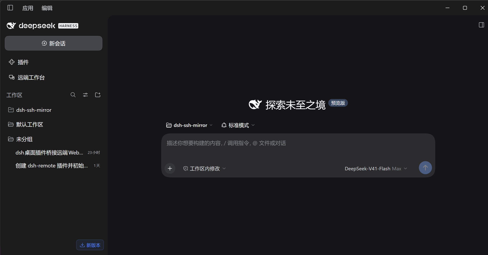

1、wsl运行日志 
===== dsh-remote-desks 诊断 =====
生成时间：2026-09-29T16:49:15.906Z
插件：远端工作台 0.1.0｜里程碑 M4 · 多实例并发 / 五种容器 / 更新与回滚
运行形态：win32/x64｜Node 24.18.1｜Electron 44.0.0
DSH 运行时：找到｜0.2.0-rc.2｜入口：D:\Users\TBChaos\AppData\Local\Programs\DeepSeek Harness\resources\app.asar\dsh\node_modules\@deepseek-ai\dsh\lib\bin.js
控制接口：/remote-desks｜闸门：connection.requestRejection + loopback-guard
宿主服务：10 项，缺 无
容器偏好（openMode）：auto
实例数：2
- [local-dev] local stopped｜未启动
- [wsl-ubuntu] wsl running｜DSH 0.2.0-rc.2｜远端端口 42480｜运行中，远端端口 42480
    上次更新：0.1.5-rc.3 → 0.2.0-rc.2｜更新命令以 0 退出（版本 0.1.5-rc.3 → 0.2.0-rc.2）
当前选中：wsl-ubuntu｜容器说明：桌面原生视图已加载，但里面看起来是空的（远端界面可能没渲染出来）。可以点右侧按钮改用内嵌框架。
---- 日志尾部（wsl-ubuntu）----
16:48:03 更新：npm i -g @deepseek-ai/dsh@latest（当前版本 0.1.5-rc.3）
16:48:51 added 541 packages in 46s
16:48:51 64 packages are looking for funding
16:48:51   run `npm fund` for details
16:48:51 [stderr] npm warn deprecated node-domexception@1.0.0: Use your platform's native DOMException instead
16:48:52 更新结果：更新命令以 0 退出（版本 0.1.5-rc.3 → 0.2.0-rc.2）
16:49:02 启动：Ubuntu-24.04 内执行：dsh --profile mirror-wsl-ubuntu --port 0 --no-open（cwd /home/zmh）
16:49:04 dsh web: http://127.0.0.1:42480/?token=***（原日志里的进程令牌已抹掉）
16:49:04 会话换取：HTTP 303，已取得会话 cookie
16:49:04 WSL 回环端口 42480 在 Windows 侧可达，直连
16:49:04 [wsl-ubuntu] 镜像端点已监听 http://127.0.0.1:54350（上游 local → 127.0.0.1:42480）
16:49:04 镜像入口 http://127.0.0.1:54350/?k=***（同上，票据已抹掉）

2、启动界面一直在抖，没有正常显示任何东西；

3、本机内置运行，我打开dsh桌面软件应该默认是启动的但是现在显示的是未启动；

4、
在这个界面右上角或者左上角加一个下拉框 允许我选择 本机还是wsl 。
当我选择本机 那么就直接连接本机的服务端口；当我选择wsl 那么就连接wsl的服务端口。